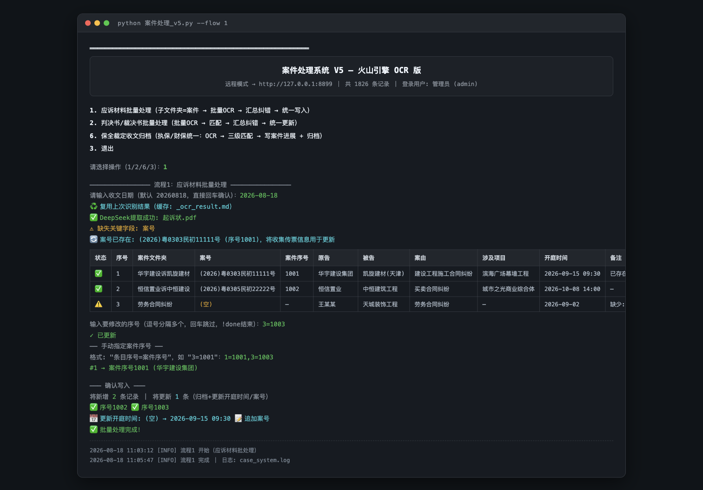

# 案件处理系统 V5

法务案件自动化处理工具：基于**火山引擎 OCR** 识别诉讼文书 PDF，配合 **DeepSeek 大模型**提取案件要素，自动完成应诉材料归档、判决书更新、保全裁定归档三大流程，写入统一案件管理系统（远程 API）。

> 纯 Python 标准库实现，**零第三方依赖**，支持 Windows / macOS / Linux。

## 运行预览



## 功能特性

- **三大处理流程**
  - **流程 1 · 应诉材料批处理**：按「子文件夹 = 案件」批量 OCR 起诉状 / 传票 / 仲裁申请书等，汇总提取要素，人工纠错后统一写入案件库并归档
  - **流程 2 · 判决书 / 裁决书批处理**：批量 OCR 判决书 / 仲裁裁决书，按案号自动匹配数据库记录，人工纠错后统一更新案件进展并归档
  - **流程 6 · 保全裁定收文归档**：执保 / 财保裁定统一处理，OCR → 当事人三级模糊匹配 → 追加案件进展 + 归档
- **智能文件识别**：根据文件名自动区分「起诉状 / 传票（走 OCR）」与「证据材料（直接归档，不 OCR）」
- **断点续跑**：每个文件的 OCR 结果写入 md 缓存（`*.ocr.md` / `_ocr_result.md`），运行中断后再次执行自动复用，不重复消耗 OCR 额度
- **健壮性**：API 调用带指数退避重试，业务错误（如配额不足）不盲目重试
- **人工纠错环节**：每条识别结果先汇总展示，确认 / 修正后再写入，避免脏数据入库
- **命令行自动化**：`--auto` 跳过人工确认，`--flow` 直接指定流程，便于定时任务调度
- **多用户**：连接远程案件管理系统（HTTP API），登录后写入，权限受服务器控制

## 环境要求

- Python 3.8+（仅标准库，无 pip 依赖）
- 可访问的**案件管理系统服务器**（HTTP API，提供 `/api/login` 等接口）
- [火山引擎 OCR](https://www.volcengine.com/product/ocr) 账号（AK/SK）
- [DeepSeek](https://platform.deepseek.com/) API Key

## 登录与权限

系统连接远程案件管理服务器，**所有操作均需登录**：

- **登录密码**：启动后需输入用户名 / 密码登录（凭据在 `.env` 的 `LOGIN_USERNAME` / `LOGIN_PASSWORD` 中配置，或使用服务器分配的账号）。未登录时无法进入操作菜单。
- **编辑权限**：新增案件、更新案件进展、登记付款计划、归档文件等**所有写操作**都需要管理员角色的编辑权限，由服务器端校验（会话令牌失效或权限不足时返回 403 并提示重新登录）。
- **只读安全**：会话令牌仅保存在内存中，不落盘；退出程序即失效。

## 快速开始

### 1. 下载与配置

```bash
git clone <你的仓库地址>
cd 法务案件处理系统

# 复制配置模板并填入真实值
cp .env.example .env
```

编辑 `.env`：

| 配置项 | 说明 |
|---|---|
| `VOLCENGINE_AK` / `VOLCENGINE_SK` | 火山引擎访问密钥（用于 OCR） |
| `DEEPSEEK_API_KEY` | DeepSeek API Key（用于要素提取） |
| `DEEPSEEK_MODEL` | 模型名，默认 `deepseek-v4-pro` |
| `DEEPSEEK_BASE_URL` | API 地址，使用中转 / 代理时修改 |
| `SERVER_URL` | 案件管理系统服务器地址，如 `http://127.0.0.1:8899` |
| `LOGIN_USERNAME` / `LOGIN_PASSWORD` | 系统登录凭据 |
| `RESPONSE_FOLDER` / `JUDGMENT_FOLDER` / `PRESERVE_FOLDER` | 各流程默认处理文件夹 |
| `CASE_FOLDER` / `CASE_FOLDER_2` | 归档目标目录（按年度拆分） |
| `DEEPSEEK_MAX_RETRIES` / `OCR_MAX_RETRIES` | （可选）失败重试次数，默认 2 |

> ⚠️ `.env` 含真实密钥，已在 `.gitignore` 中忽略，**切勿提交到版本库**。

### 2. 运行

```bash
# 交互模式：启动后按菜单选择流程（1 / 2 / 6）
python 案件处理_v5.py

# 直接运行流程 1（应诉材料批处理），自动模式跳过人工确认
python 案件处理_v5.py --flow 1 --auto

# 覆盖默认文件夹 / 收文日期
python 案件处理_v5.py --flow 2 --folder "D:\判决书" --date 20260818
```

### 3. 命令行参数

| 参数 | 说明 |
|---|---|
| `--flow 1\|2\|6` | 直接指定流程，跳过菜单：1=应诉材料，2=判决书/裁决书，6=保全裁定 |
| `--folder PATH` | 覆盖默认处理文件夹 |
| `--date YYYYMMDD` | 覆盖收文日期 |
| `--auto` | 自动模式：跳过所有人工确认，取推荐默认值（适合定时任务） |

## 目录结构

```
法务案件处理系统/
├── 案件处理_v5.py      # 主入口：配置加载、OCR、DeepSeek 提取、日志、主菜单
├── flow_response.py    # 流程 1：应诉材料批处理
├── flow_judgment.py    # 流程 2：判决书/裁决书批处理
├── flow_preserve.py    # 流程 6：保全裁定收文归档
├── db.py               # 数据层：远程 HTTP API 封装（登录/查询/写入）
├── .env.example        # 配置模板（提交）
├── .env                # 实际配置（含密钥，不提交）
└── .gitignore
```

## 工作原理

```
案件 PDF 文件夹
    │
    ▼
文件类型识别（起诉状/传票 → OCR；证据 → 直接归档）
    │
    ▼
火山引擎 OCR（PDF base64 直传，3 线程并发）──→ md 缓存（断点续跑）
    │
    ▼
DeepSeek 提取案件要素（案号/当事人/开庭时间/诉讼请求…）
    │
    ▼
汇总展示 + 人工纠错 ──→ 数据库匹配（案号匹配 / 当事人三级模糊匹配）
    │
    ▼
统一写入案件库（远程 API）+ 文件归档
```

- **数据存储**：统一走远程 HTTP API（本地 SQLite 模式已在 V5 中移除）
- **断点续跑**：OCR 结果缓存在 `*.ocr.md`，流程正常完成自动删除；中断后重启自动复用
- **日志**：运行日志写入脚本同目录 `case_system.log`（已 gitignore）

## 常见问题

**Q：OCR 报配额 / 参数错误？**
属于业务错误，程序不会重试。请检查 `.env` 中火山引擎 AK/SK 是否正确、账号是否欠费。

**Q：提示「无法连接到服务器」？**
确认 `SERVER_URL` 指向的案件管理系统已启动，且本机可访问（网络 / 防火墙）。

**Q：中断后重新运行会不会重复 OCR？**
不会。未完成批次的 `*.ocr.md` 缓存会被自动复用，跳过重复识别。

## 免责声明

本工具仅用于内部法务工作流程自动化。识别与提取结果可能包含误差，重要信息请以人工核对为准。
